# MDSA Framework - Complete Architecture Documentation with Mermaid Diagrams

## 1. HIGH-LEVEL SYSTEM ARCHITECTURE

```mermaid
graph TB
    subgraph "User Interface Layer"
        UI[Web UI - localhost:8000/monitor]
        API[REST API Endpoints]
        CLI[Command Line Interface]
    end
  
    subgraph "Core Orchestration Layer"
        ORCH[TinyBERT Orchestrator<br/>67M params - CPU]
        ROUTER[Intent Router<br/>95% Accuracy]
        SM[State Machine<br/>Workflow Controller]
        MB[Message Bus<br/>Event System]
    end
  
    subgraph "Domain Management Layer"
        DR[Domain Registry]
        DB[Domain Builder]
        DT[Domain Templates]
    
        subgraph "Domain 1: Finance"
            D1M1[SLM-Transactions 8B]
            D1M2[SLM-Reporting 13B]
            D1M3[SLM-Risk 13B]
            D1RAG[Local RAG]
        end
    
        subgraph "Domain 2: Development"
            D2M1[SLM-CodeAnalysis 13B]
            D2M2[SLM-Testing 8B]
            D2M3[SLM-Integration 8B]
            D2RAG[Local RAG]
        end
    
        subgraph "Domain 3: Customer Service"
            D3M1[SLM-Support 8B]
            D3M2[SLM-Routing 7B]
            D3RAG[Local RAG]
        end
    end
  
    subgraph "Model Management Layer"
        MM[Model Manager]
    
        subgraph "Model Loaders"
            HF[HuggingFace Loader]
            GH[GitHub Loader]
            LOCAL[Local Loader]
            OLLAMA[Ollama Loader]
            OPENAI[OpenAI Loader]
            CUSTOM[Custom Loader]
        end
    end
  
    subgraph "RAG System Layer"
        LRAG[Local RAG Engine<br/>Per-Domain Knowledge]
        GRAG[Global RAG Engine<br/>Cross-Domain Knowledge]
        VS[Vector Store<br/>Chroma/FAISS/Pinecone]
        EMB[Embedding Models<br/>SentenceTransformers]
    end
  
    subgraph "Communication Layer"
        BUS[Message Bus]
        BRIDGE[SLM Bridge<br/>Model-to-Model]
        TOOL[Tool Adapter<br/>Model-to-Tool]
        PROTO[Communication Protocols]
    end
  
    subgraph "Validation Layer"
        RULES[Rule-Based Validator<br/>Pure Python]
        REASON[Reasoning Validator<br/>Phi-1.5 1.3B]
        SCHEMA[Schema Validator<br/>JSON Schema]
    end
  
    subgraph "Integration Layer"
        MCP[MCP Manager<br/>Model Context Protocol]
        APIM[API Key Manager<br/>Encrypted Storage]
        TOOLS[External Tools]
    end
  
    subgraph "Monitoring & Observability Layer"
        MC[Metrics Collector]
        ET[Event Tracker]
        RM[Resource Monitor<br/>CPU/GPU/Memory]
        FA[Flow Analyzer]
        WS[WebSocket Server]
        PROM[Prometheus Exporter]
    end
  
    subgraph "Storage Layer"
        CACHE[Model Cache<br/>~/.mdsa/models/]
        VSTORE[Vector Store DB]
        LOGS[Log Storage]
        CONFIG[Config Files<br/>YAML]
    end
  
    UI --> API
    CLI --> API
    API --> ORCH
  
    ORCH --> ROUTER
    ORCH --> SM
    ORCH --> MB
  
    ROUTER --> DR
    SM --> DR
    MB --> BUS
  
    DR --> D1M1 & D1M2 & D1M3
    DR --> D2M1 & D2M2 & D2M3
    DR --> D3M1 & D3M2
  
    D1M1 & D1M2 & D1M3 --> D1RAG
    D2M1 & D2M2 & D2M3 --> D2RAG
    D3M1 & D3M2 --> D3RAG
  
    D1RAG & D2RAG & D3RAG --> LRAG
    LRAG --> GRAG
    GRAG --> VS
    VS --> EMB
  
    MM --> HF & GH & LOCAL & OLLAMA & OPENAI & CUSTOM
    MM --> CACHE
  
    D1M1 & D1M2 & D1M3 & D2M1 & D2M2 & D2M3 & D3M1 & D3M2 --> MM
  
    BUS --> BRIDGE
    BUS --> TOOL
    BRIDGE --> PROTO
  
    SM --> RULES
    SM --> REASON
    SM --> SCHEMA
  
    ORCH --> MCP
    MCP --> APIM
    MCP --> TOOLS
  
    ORCH --> MC
    BUS --> ET
    MM --> RM
    ROUTER --> FA
  
    MC & ET & RM & FA --> WS
    MC --> PROM
    WS --> UI
  
    CONFIG --> DR
    LOGS --> ET
    VSTORE --> VS
  
    style UI fill:#e1f5ff
    style ORCH fill:#fff9c4
    style D1M1 fill:#00008B
    style D2M1 fill:#00008B
    style D3M1 fill:#00008B
    style LRAG fill:#c8e6c9
    style MC fill:#f5f5f5

```

## 2. DETAILED ORCHESTRATION FLOW

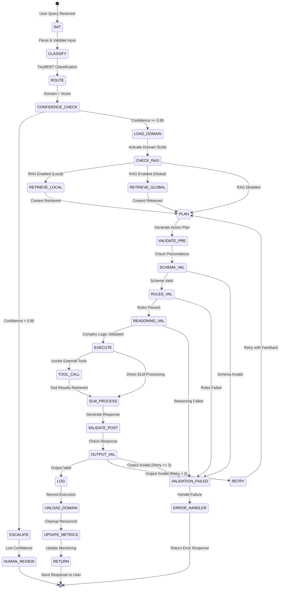

## 3. DOMAIN CREATION WORKFLOW

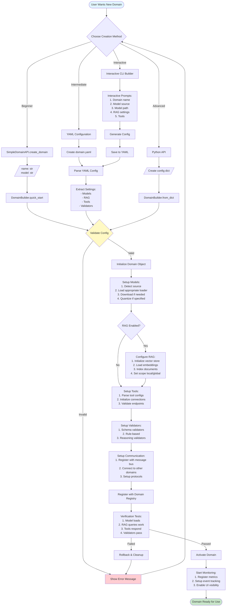

## 4. MODEL LOADING ARCHITECTURE

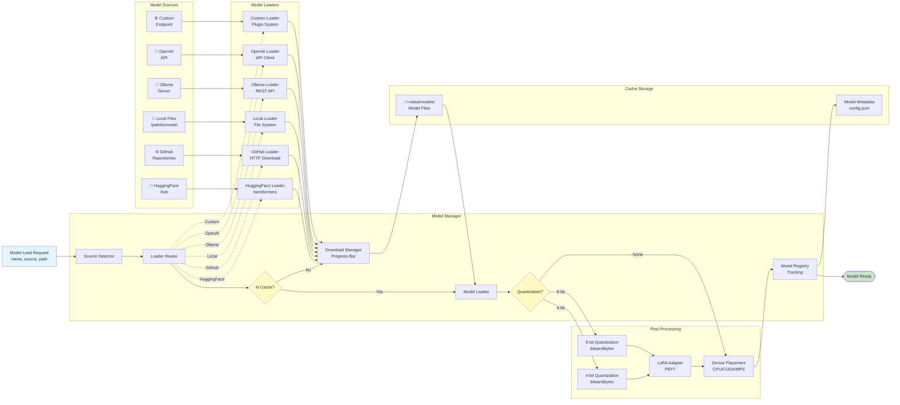

## 5. RAG SYSTEM ARCHITECTURE

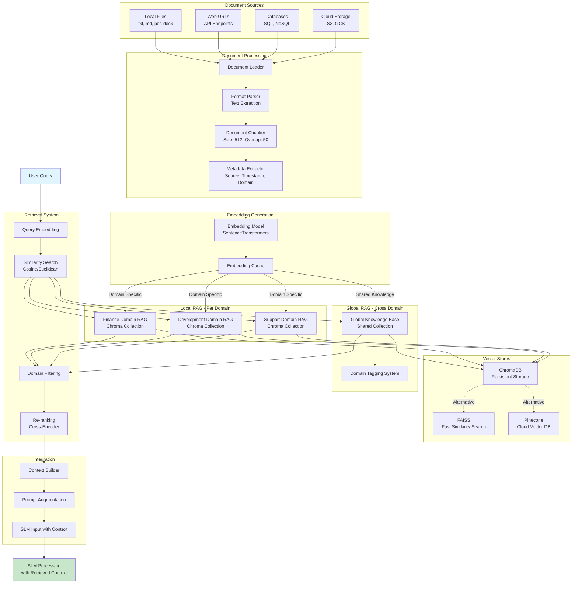

## 6. COMMUNICATION & MESSAGE FLOW

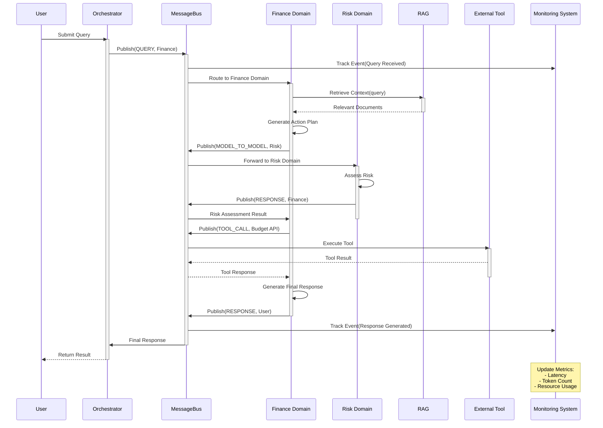

## 7. VALIDATION PIPELINE

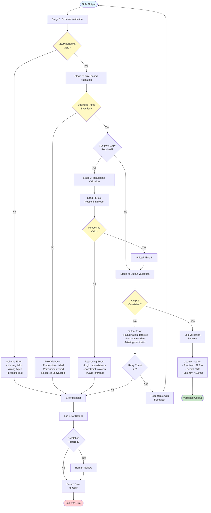

## 8. MONITORING SYSTEM ARCHITECTURE

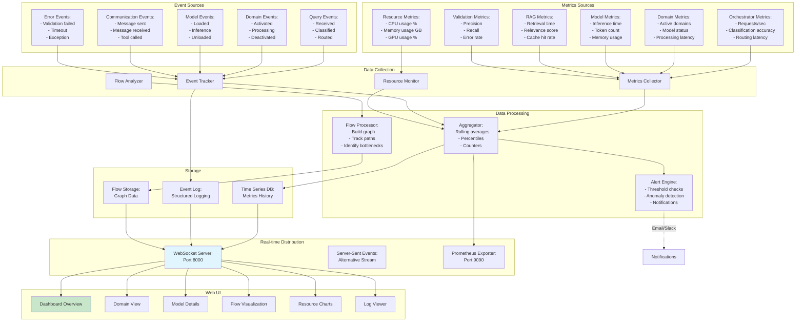

## 9. COMPLETE REQUEST LIFECYCLE

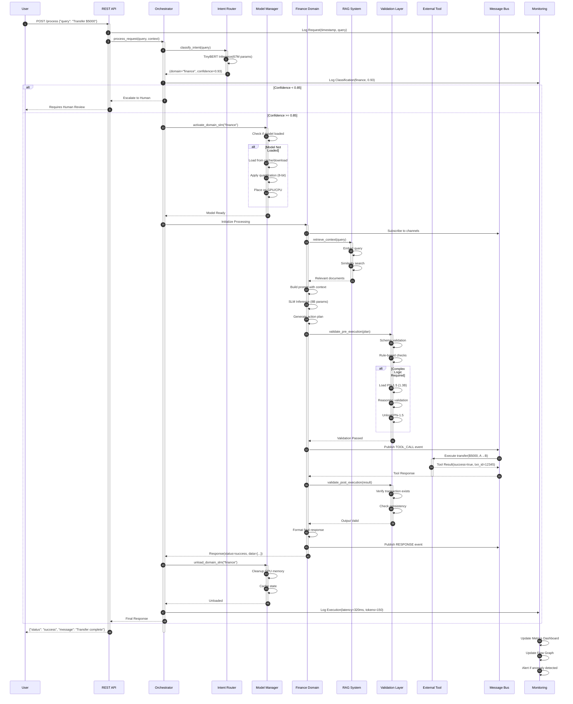

## 10. CLASS DIAGRAM - CORE COMPONENTS

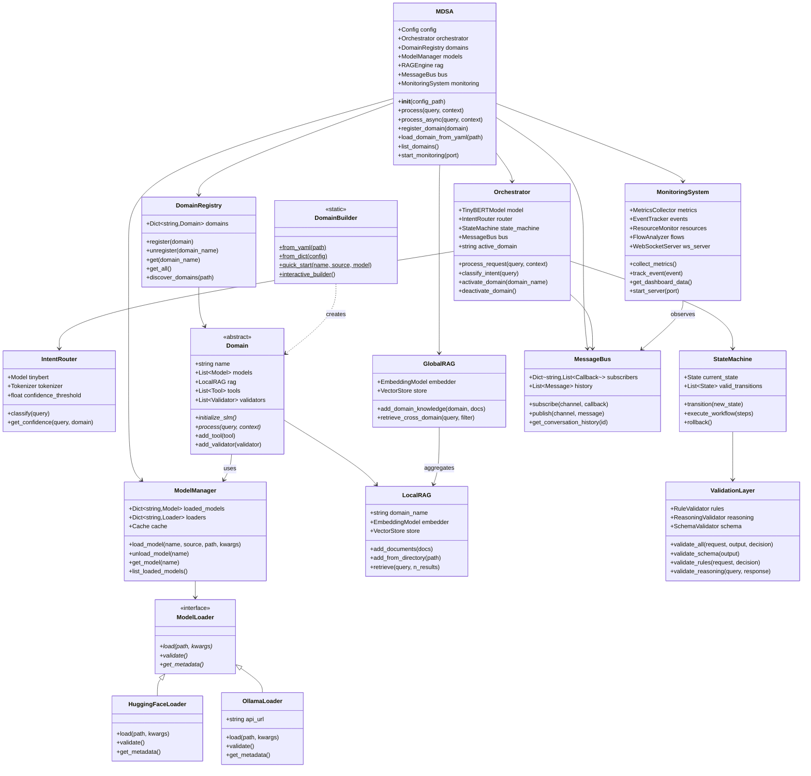

## 11. DEPLOYMENT ARCHITECTURE

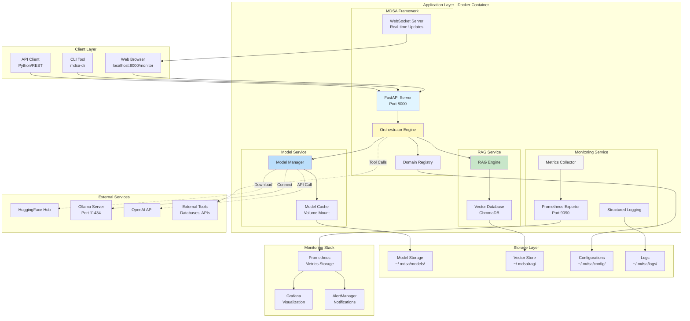

## 12. DATA FLOW - END-TO-END

```mermaid
flowchart TB
    START([User Query: Transfer $5000]) --> INPUT_VAL[Input Validation<br/>Check query format]
  
    INPUT_VAL --> ORCH_RECEIVE[Orchestrator<br/>Receive Request]
  
    ORCH_RECEIVE --> INTENT_CLASS[Intent Classification<br/>TinyBERT: 67M params<br/>Latency: 45ms]
  
    INTENT_CLASS --> CONFIDENCE{Confidence<br/>>= 0.85?}
  
    CONFIDENCE -->|No: 0.72| ESCALATE[Escalate to Human<br/>Low Confidence]
    ESCALATE --> END1([End: Human Review])
  
    CONFIDENCE -->|Yes: 0.93| DOMAIN_SELECT[Select Domain:<br/>Finance]
  
    DOMAIN_SELECT --> MODEL_CHECK{Finance Models<br/>Loaded?}
  
    MODEL_CHECK -->|No| LOAD_MODELS[Load Models:<br/>- SLM-Transactions 8B<br/>- SLM-Risk 13B<br/>Latency: 2000ms]
  
    MODEL_CHECK -->|Yes| RAG_CHECK
    LOAD_MODELS --> RAG_CHECK{RAG<br/>Enabled?}
  
    RAG_CHECK -->|Yes| RAG_RETRIEVE[Retrieve Context:<br/>1. Embed query<br/>2. Similarity search<br/>3. Get top 5 docs<br/>Latency: 50ms]
  
    RAG_CHECK -->|No| BUILD_PROMPT
    RAG_RETRIEVE --> BUILD_PROMPT[Build Prompt<br/>with Context]
  
    BUILD_PROMPT --> SLM_INFERENCE[SLM Inference:<br/>SLM-Transactions<br/>Latency: 150ms]
  
    SLM_INFERENCE --> ACTION_PLAN[Generate Action Plan:<br/>1. Validate amount<br/>2. Check balance<br/>3. Execute transfer]
  
    ACTION_PLAN --> VAL_STAGE1[Validation Stage 1:<br/>Schema Check<br/>Latency: 5ms]
  
    VAL_STAGE1 --> SCHEMA_OK{Schema<br/>Valid?}
  
    SCHEMA_OK -->|No| VAL_FAIL[Validation Failed]
    VAL_FAIL --> ERROR_HANDLE[Error Handler]
    ERROR_HANDLE --> END2([End: Error Response])
  
    SCHEMA_OK -->|Yes| VAL_STAGE2[Validation Stage 2:<br/>Business Rules<br/>Latency: 10ms]
  
    VAL_STAGE2 --> RULES_OK{Rules<br/>Pass?}
  
    RULES_OK -->|No| VAL_FAIL
  
    RULES_OK -->|Yes| COMPLEX{Complex<br/>Logic?}
  
    COMPLEX -->|Yes| VAL_STAGE3[Validation Stage 3:<br/>Phi-1.5 Reasoning<br/>Latency: 80ms]
  
    VAL_STAGE3 --> REASONING_OK{Reasoning<br/>Valid?}
    REASONING_OK -->|No| VAL_FAIL
    REASONING_OK -->|Yes| EXECUTE_TOOL
  
    COMPLEX -->|No| EXECUTE_TOOL[Execute Tool:<br/>Bank API Transfer<br/>Latency: 100ms]
  
    EXECUTE_TOOL --> TOOL_RESULT{Tool<br/>Success?}
  
    TOOL_RESULT -->|No| TOOL_ERROR[Tool Error]
    TOOL_ERROR --> RETRY{Retry<br/>< 3?}
    RETRY -->|Yes| EXECUTE_TOOL
    RETRY -->|No| ERROR_HANDLE
  
    TOOL_RESULT -->|Yes| OUTPUT_VAL[Output Validation:<br/>Verify transaction<br/>Latency: 15ms]
  
    OUTPUT_VAL --> OUTPUT_OK{Output<br/>Consistent?}
  
    OUTPUT_OK -->|No| VAL_FAIL
  
    OUTPUT_OK -->|Yes| FORMAT_RESP[Format Response:<br/>Status, TXN ID, Balance]
  
    FORMAT_RESP --> LOG_EXEC[Log Execution:<br/>- Total latency: 320ms<br/>- Tokens used: 150<br/>- Memory: 8GB peak]
  
    LOG_EXEC --> UPDATE_METRICS[Update Metrics:<br/>- Request count +1<br/>- Avg latency: 325ms<br/>- Success rate: 98.5%]
  
    UPDATE_METRICS --> UNLOAD_CHECK{Other<br/>Requests?}
  
    UNLOAD_CHECK -->|No| UNLOAD_MODELS[Unload Finance Models<br/>Free 8GB memory]
    UNLOAD_CHECK -->|Yes| KEEP_LOADED
  
    UNLOAD_MODELS --> SEND_RESPONSE
    KEEP_LOADED[Keep Models Loaded] --> SEND_RESPONSE[Send Response to User]
  
    SEND_RESPONSE --> MONITOR_UPDATE[Update Monitor UI:<br/>- Real-time graph<br/>- Metrics dashboard<br/>- Activity log]
  
    MONITOR_UPDATE --> END3([End: Success])
  
    style START fill:#e1f5ff
    style END3 fill:#c8e6c9
    style END1 fill:#fff9c4
    style END2 fill:#ffcdd2
    style CONFIDENCE fill:#fff9c4
    style SCHEMA_OK fill:#fff9c4
    style RULES_OK fill:#fff9c4
    style REASONING_OK fill:#fff9c4
    style OUTPUT_OK fill:#fff9c4
```

---

## 📊 PERFORMANCE & SCALING METRICS

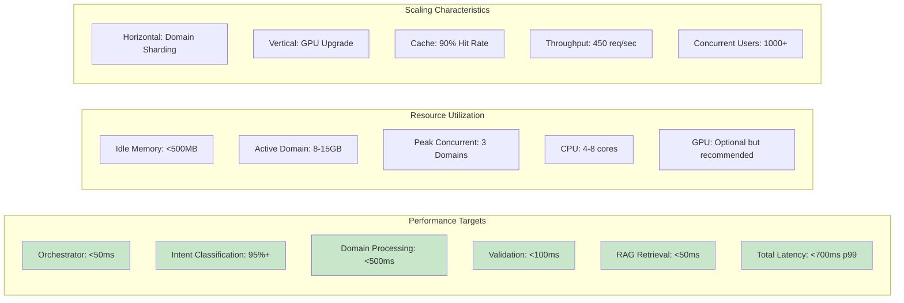

---

This comprehensive architecture documentation provides:

1. ✅ **High-level system overview** showing all major components
2. ✅ **Detailed orchestration flow** with state management
3. ✅ **Domain creation workflow** for beginner-friendly setup
4. ✅ **Model loading architecture** supporting multiple sources
5. ✅ **RAG system design** with local and global capabilities
6. ✅ **Communication patterns** for inter-component messaging
7. ✅ **Validation pipeline** with three-stage verification
8. ✅ **Monitoring architecture** for real-time observability
9. ✅ **Complete request lifecycle** sequence diagram
10. ✅ **Class diagram** showing object relationships
11. ✅ **Deployment architecture** for production
12. ✅ **End-to-end data flow** with latency metrics

All diagrams are in Mermaid format, logically organized, and production-ready for implementation!
